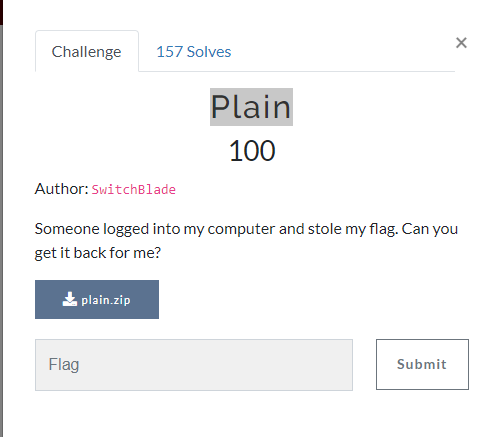
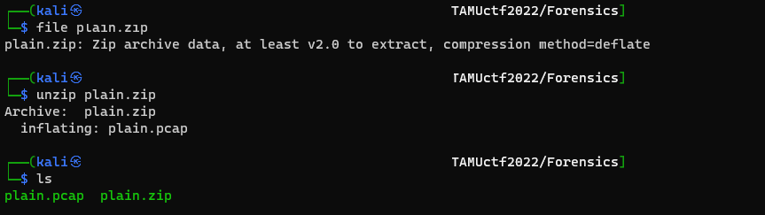
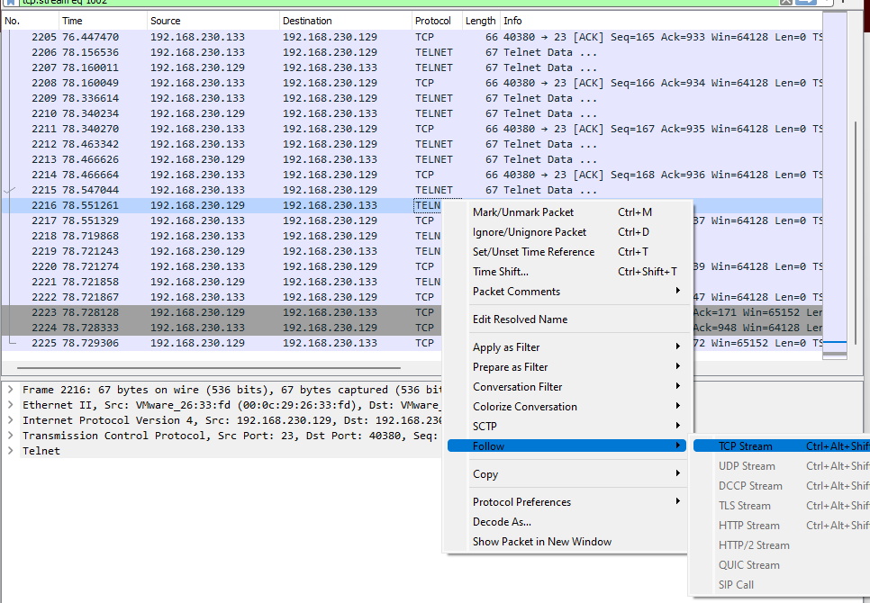
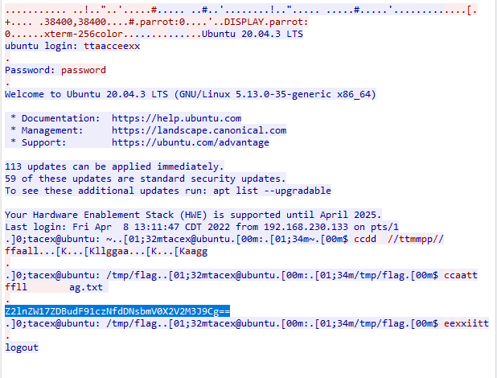

# Challenge: Plain
## Author: r1c3t
## Link: 
    https://tamuctf.com/challenges#Plain-9

- The challenge asks us to find the flag in the plain.zip file

- Check file plain.zip and extract file

- We see pcap file in the plain.zip file, we will open it on wireshark tool

- Notice, we will see a telet protocol between the machine .129 and the machine .133, we will observe it with TCP stream.

- In the conversation between the two machines, we see the command line read Flag: cat flag.txt... What we get is a base64 string `Z2lnZW17ZDBudF91czNfdDNsbmV0X2V2M3J9Cg==`

- Decoding us is flag is `gigem{d0nt_us3_t3lnet_ev3r}`

## Flag is `gigem{d0nt_us3_t3lnet_ev3r}`