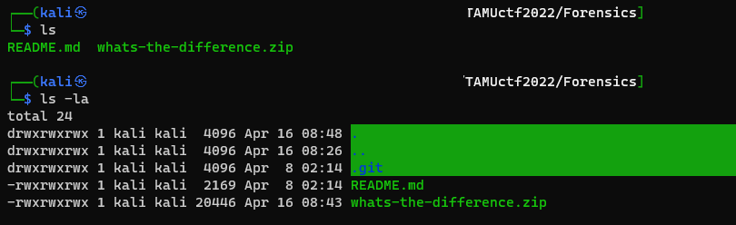
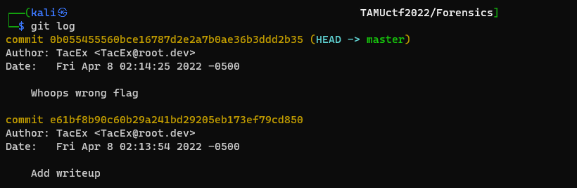
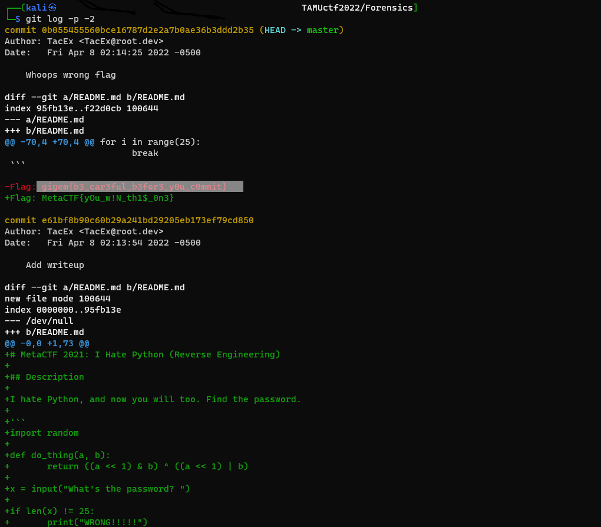

# Challenge: What's the Difference
## Author: r1c3t
## Link: 
    https://tamuctf.com/challenges

- After extract file .zip we have file README.md, we use command `ls -la` to has folder .git, this is folder repo git.

- We use command `git log` to show all commit in repo.

- Use option -p -2 to be able to show the changes, we see flag: gigem{b3_car3ful_b3for3_y0u_c0mmit}

## Flag is `gigem{b3_car3ful_b3for3_y0u_c0mmit}`