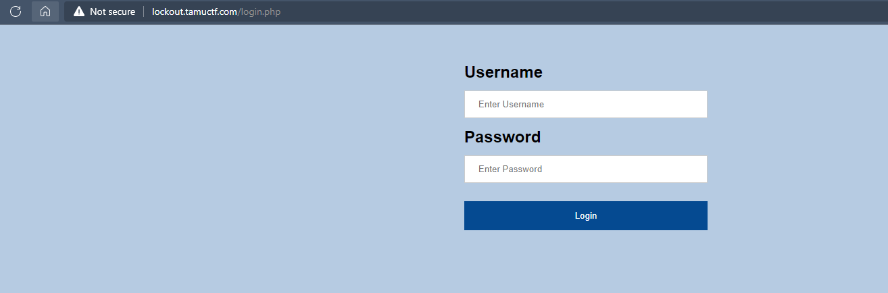
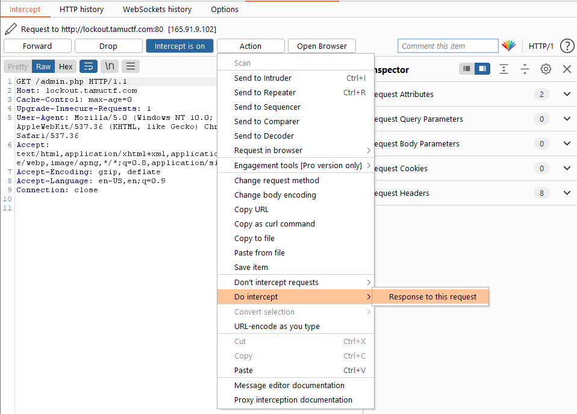
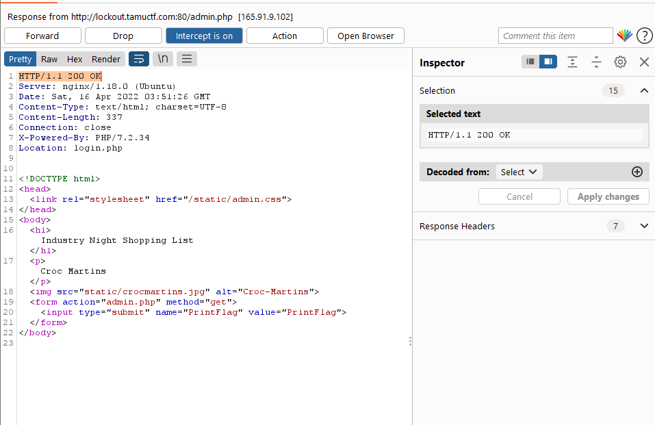
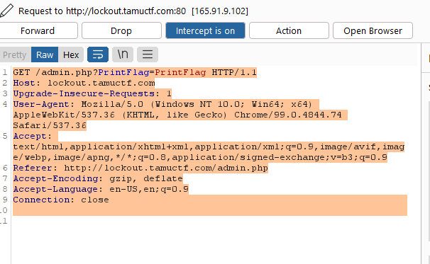
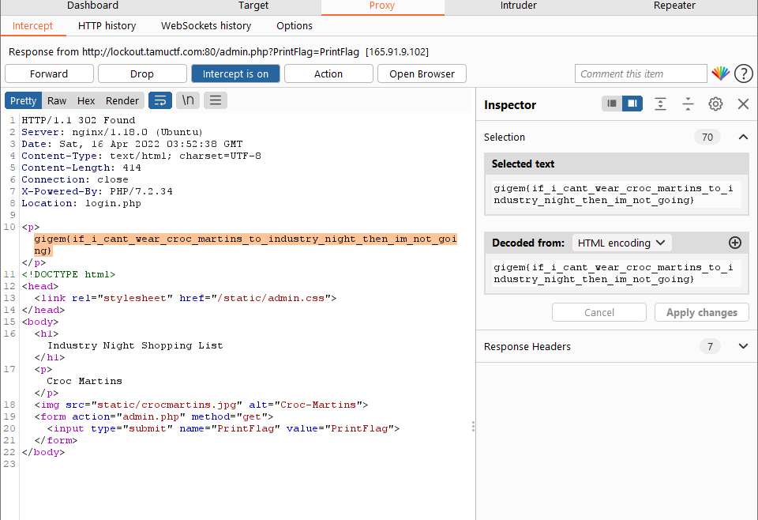

# Challenge: Lock Out
## Author: r1c3t

- Challenge us the login.php page

- Use Burp Suite to see HTTP request. We will use the `Response to this request` feature to be able to modify the response from the request

- Edit status from 302 to 200 OK

- Then, the browser will render a new page, there is a PrintFlag button, we click on it to send a GET request to the server.

- Observing the returned payload we see the value of flag

## Flag is `gigem{if_i_cant_wear_croc_martins_to_industry_night_then_im_not_going}`