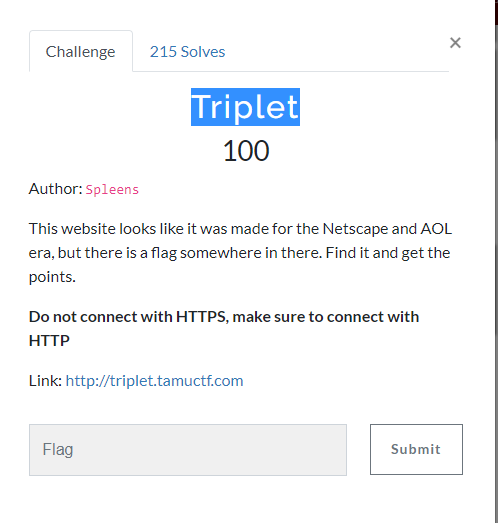
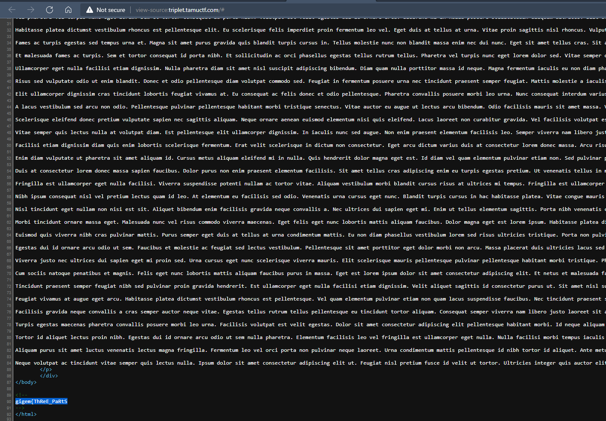
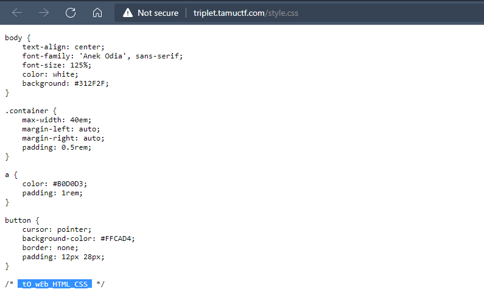

# Challenge: Triplet
## Author: r1c3t

- Check Source code, we will see part of flag

- Looking at the beginning of the source code, we see there are 2 css and js files, we proceed to check it, we will see part of flag in file script.js and file style.css

- Concatenating the parts of the flag we get the string `gigem{ThReE_PaRtS_tO_wEb_HTML_CSS_AND_JS_0xCHICKEN}`
## Flag is `gigem{ThReE_PaRtS_tO_wEb_HTML_CSS_AND_JS_0xCHICKEN}`